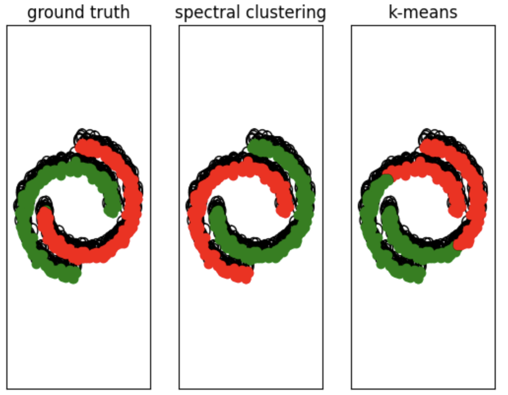
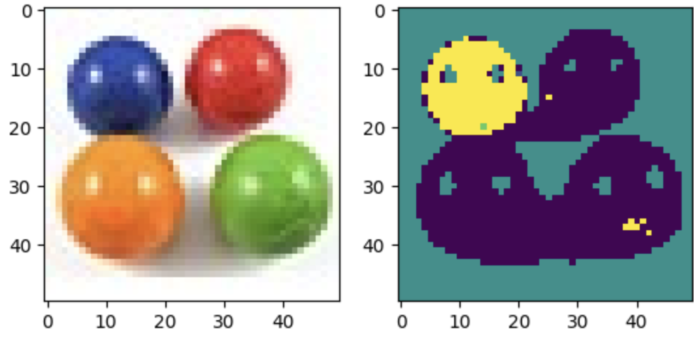

# Spectral-Clustering
TP
|| | 

In this exercise, we implement spectral clustering and try it on diffent kinds of data:

* N-blob: Random points in $\mathbb{R}^2$ according to N Gaussian distributions with different means;

* Two moons: Random points shaped as two intertwined moons;

* Point and circle: random points from a concentrated Gaussian point in the middle and a wide circle around it.

We use the following similarity:
$$d(x_i, x_j) = \exp\left(-\frac{||x_i-x_j||_2^2}{2\sigma^2}\right)$$

Using this similarity, we compute the weight matrix W representing the graph, compute the graph Laplacian L and finally use its eigenvectors for clustering.
